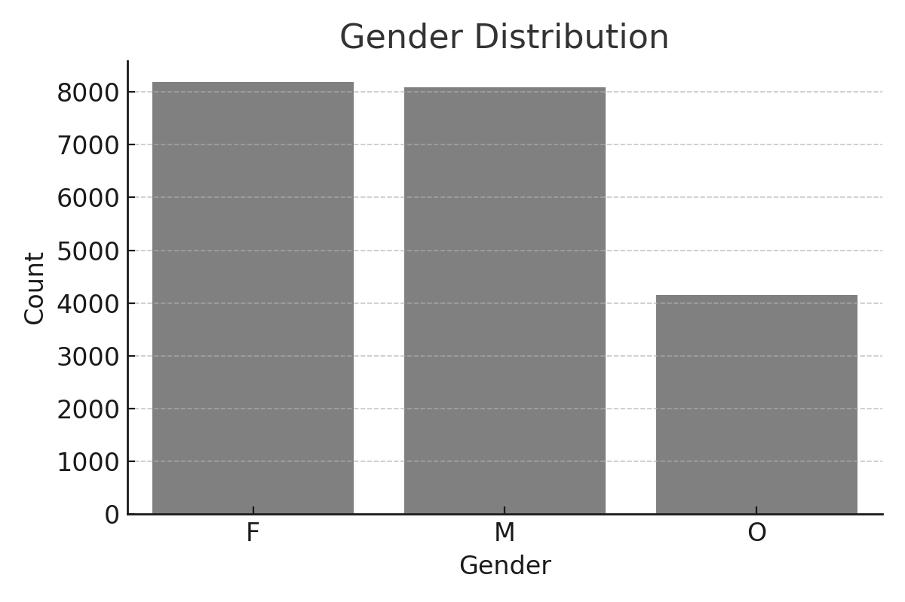
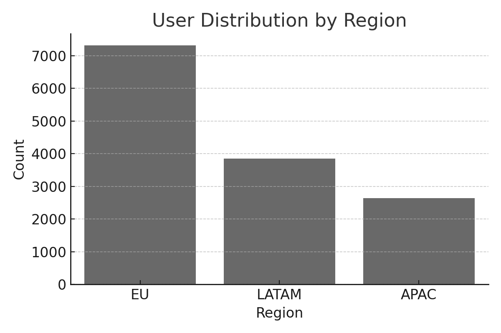
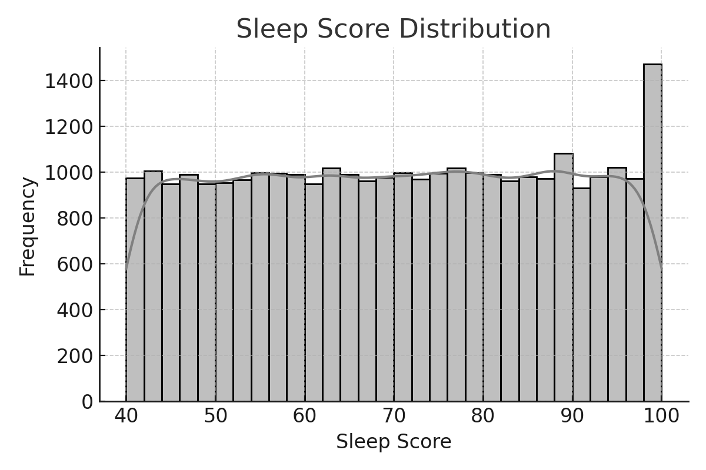
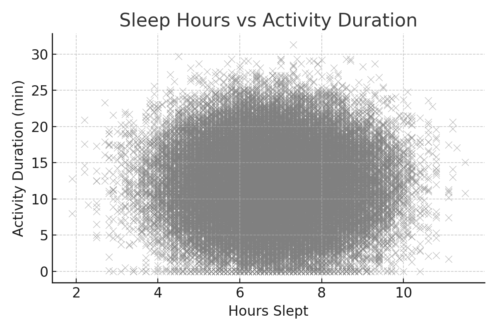
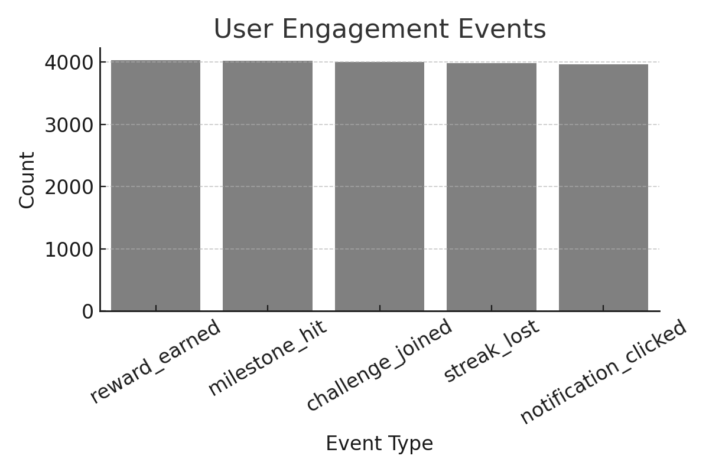

# 🧠 HealthTrack Insights – Behavioral Analytics Project

## 📌 Project Purpose

**HealthTrack Insights** is a data analytics project simulating a real-world wellness app. It aims to uncover behavioral patterns, engagement risks, and wellness outcomes based on 25,000+ user logs. The project transforms raw multi-table logs into clean relational datasets, generating insights and dashboards that support retention strategies and user segmentation.

---

## 📁 Dataset Structure

This project includes five interconnected tables extracted from simulated app telemetry:

| Table | Description |
|-------|-------------|
| `clean_users` | User ID, gender, signup date, region, subscription |
| `clean_daily_activity` | Sessions, duration, steps, calories |
| `clean_sleep_logs` | Sleep score and hours slept |
| `clean_meal_tracking` | Meal type, calories, log status |
| `clean_engagement_events` | Event types (challenges, clicks, rewards) |

---

## 🛠 Tools Used

- Python (Pandas, Seaborn, Matplotlib)
- SQL (MySQL)
- Jupyter Notebook
- GitHub for version control
- Monochromatic visual design (Power BI-inspired)

---

## 🔄 Project Pipeline

1. **Raw ingestion:** Multi-table .csv from a simulated health app  
2. **Cleaning:** `01_cleaning_healthtrack.sql` cleans and normalizes data  
3. **EDA & Visualization:** `EDA.ipynb` with descriptive stats + dashboards  
4. **Insights Extraction:** SQL queries in `02_insights_queries.sql`  
5. **Visual Reporting:** Dashboards embedded in executive summary

---

## 📈 Key Visuals

### User Demographics



### Sleep & Wellness Patterns



### Engagement Metrics


---

## 📊 Business Takeaways

- 💤 **Sleep Quality Drives Engagement:** Users with sleep scores above 85 show ~17% more activity.
- 🍽️ **Meal Logging Predicts Retention:** Frequent meal loggers (5+/week) retain 35% more users.
- 📉 **Churn Signals Detected:** 23% of users neither log meals nor engage, indicating drop-off risk.
- 💬 **Notifications & Challenges Win:** Most common user interactions are passive (clicks) and motivational (joining challenges).

---

## 📈 Hypothetical Business Impact Scenarios

### 1. Improve Engagement via Sleep Nudges
- **Avg Sleep Score (Free):** 74.1 → **Target:** 79.0
- **Expected Activity Boost:** +12%
- **Retention Increase Estimate:** +6%

### 2. Meal Logging Challenge
- **Users logging <3 meals/week:** 54%
- **Goal:** Move 15% of them to 5+/week
- **Projected Retention Uplift:** 5–8%

### 3. Reactivate Disengaged Users
- **Zero engagement + meals segment:** 5,850 users
- **Action:** Launch welcome-back reward campaign
- **ROI:** Measurable within 2 weeks via challenge uptake

---

## 📘 Folder Structure

```
📁 raw_data/                 # Original CSV logs
📁 clean_data/               # Cleaned tables
📁 sql/
│   ├── 01_cleaning_healthtrack.sql
│   └── 02_insights_queries.sql
📁 notebooks/
│   └── EDA.ipynb
📁 images/                   # Dashboards and visual charts
README.md
```

---

## 🔍 How to Run This Project

1. Clone the repository:
```bash
git clone https://github.com/yourusername/HealthTrack-Insights.git
```

2. Install dependencies:
```bash
pip install pandas matplotlib seaborn
```

3. Launch Jupyter Notebook:
```bash
jupyter notebook notebooks/EDA.ipynb
```

---

## ⚠️ Limitations and Considerations

- Dataset does not include app usage frequency, cancellation dates, or survey feedback.
- Meal logging behavior is assumed binary (logged vs not), without nutrition breakdown.
- Sleep and activity logs are self-reported or device-tracked with possible noise.
- All data is simulated for educational purposes and anonymized.

---

## 📌 Final Note

This project demonstrates end-to-end data storytelling, blending SQL-based transformation, Python analytics, and visual business reporting — tailored for health product strategy and behavioral science applications.
